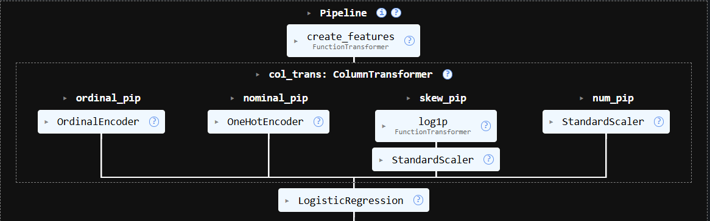
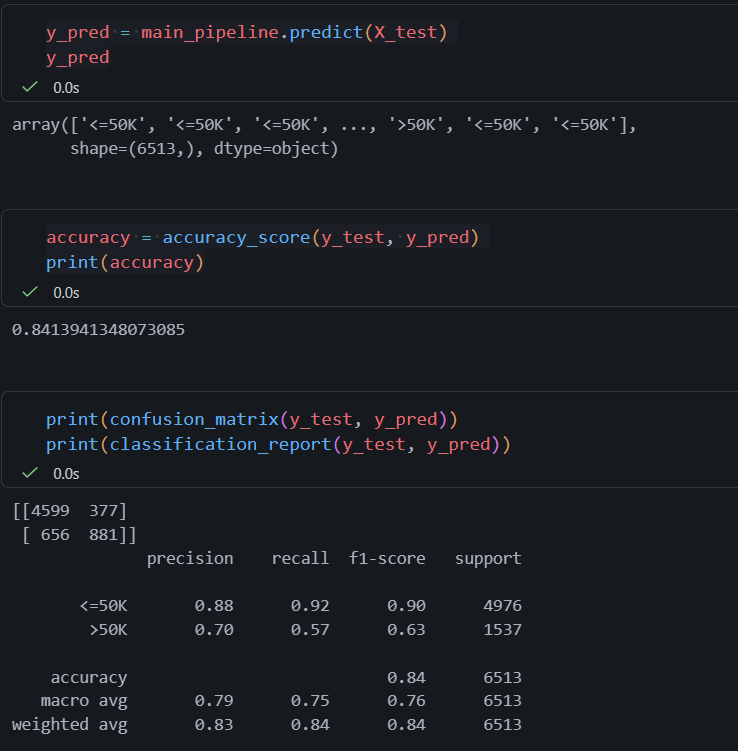
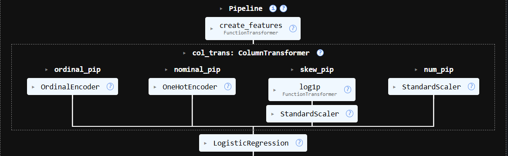
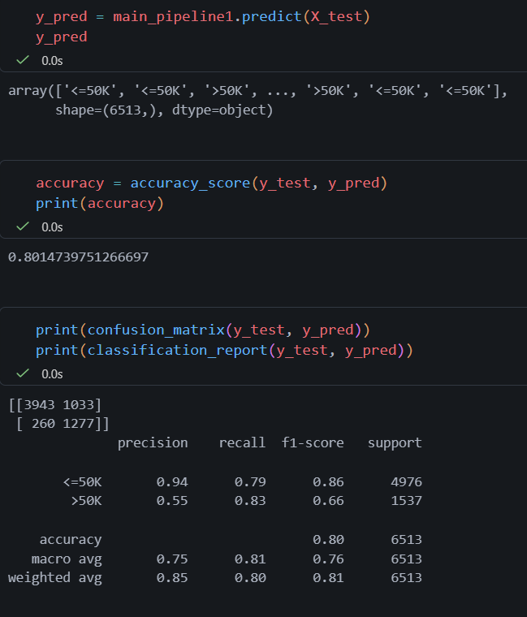
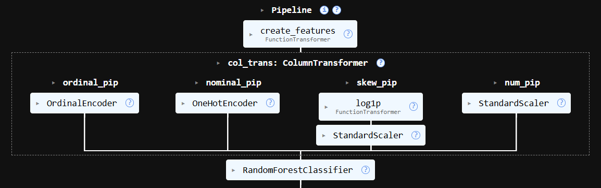
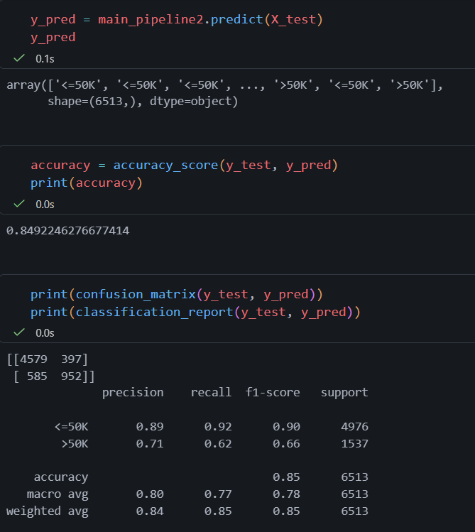

# 💼 End-to-End Feature Engineering Pipeline for Salary Prediction

## 📌 Project Overview

This project builds a complete **machine learning pipeline** to predict whether a person earns **more than 50K or less/equal to 50K** using the Adult Census Income dataset.

The focus of this project is not just modeling, but **feature engineering, preprocessing, and building a production-ready pipeline** using Scikit-learn.

---

## 🎯 Objectives

* Perform **data cleaning and preprocessing**
* Handle **missing values and categorical inconsistencies**
* Apply **feature engineering techniques**
* Build a **modular pipeline using ColumnTransformer**
* Compare multiple models:

  * Logistic Regression
  * Logistic Regression (with class balancing)
  * Random Forest
* Evaluate models using **accuracy, confusion matrix, and classification report**

---

## 📂 Dataset

* Dataset: Adult Census Income Dataset (Kaggle)
* Target Variable: `income`

  * `<=50K`
  * `>50K`

---

## 🧠 Feature Engineering

The following custom features were created:

* **age_group**

  * Young (<30)
  * Adult (30–50)
  * Old (>50)

* **work_hours_status**

  * Part-time (<35)
  * Full-time (35–50)
  * Overworked (>50)

Feature engineering is implemented using **FunctionTransformer** to ensure it is part of the pipeline.

---

## ⚙️ Pipeline Architecture

The pipeline is built in three stages:

1. **Feature Creation**
2. **Preprocessing (ColumnTransformer)**
3. **Model Training**

```text
Raw Data
   ↓
Feature Engineering (FunctionTransformer)
   ↓
ColumnTransformer
   ├── Numerical → StandardScaler
   ├── Skewed → Log Transform + Scaling
   ├── Ordinal → OrdinalEncoder
   ├── Nominal → OneHotEncoder
   ↓
Model (Logistic / Random Forest)
```

---

## 🔧 Preprocessing Steps

### 🔹 Numerical Features

* Standard Scaling

### 🔹 Skewed Features

* Log Transformation (`log1p`)
* Standard Scaling

### 🔹 Categorical Features

* Nominal → One-Hot Encoding
* Ordinal → Ordinal Encoding

### 🔹 Missing Values

* Handled using appropriate strategies (e.g., most frequent)

---

## 🤖 Models Used

### 1. Logistic Regression

* Baseline model

### 2. Logistic Regression (Class Balanced)

* Handles class imbalance using class weights

### 3. Random Forest Classifier ✅ (Final Model)

* Captures non-linear relationships
* Provides best overall performance

---

## 📊 Model Performance

### 🔹 Logistic Regression (Baseline)

* Accuracy: ~84%
* Poor recall for `>50K`
## 📊 Pipeline Architecture


## 📈 Model Performance


---

### 🔹 Logistic Regression (Balanced)

* Accuracy: ~80%
* Recall (>50K): **0.83** (significant improvement)
## 📊 Pipeline Architecture


## 📈 Model Performance

---

### 🔹 Random Forest (Final Model)

* Accuracy: **~85%**
* Recall (>50K): ~0.62
* Balanced overall performance
## 📊 Pipeline Architecture


## 📈 Model Performance

---

## 📈 Evaluation Metrics

* Accuracy
* Confusion Matrix
* Precision, Recall, F1-score

---

## 🧠 Key Insights

* Dataset is **imbalanced**, affecting minority class performance
* Logistic Regression struggled with detecting `>50K`
* Class balancing improved recall significantly
* Random Forest achieved **best overall performance**

---

## 🚀 How to Run

1. Clone the repository

```bash
git clone https://github.com/your-username/salary-prediction-pipeline.git
cd salary-prediction-pipeline
```

2. Install dependencies

```bash
pip install -r requirements.txt
```

3. Run the notebook or script

---

## 📦 Tech Stack

* Python
* Pandas, NumPy
* Scikit-learn

---

## 📌 Future Improvements

* Hyperparameter tuning (GridSearchCV)
* Try Gradient Boosting / XGBoost
* Improve recall for minority class
* Deploy model using Flask / FastAPI

---

## 🎯 Conclusion

This project demonstrates how to build a **robust, reusable ML pipeline** with proper feature engineering and preprocessing. It highlights the importance of handling class imbalance and evaluating models beyond accuracy.

---

## 👨‍💻 Author

Sahil Pawar

---

## ⭐ If you like this project

Give it a ⭐ on GitHub!
